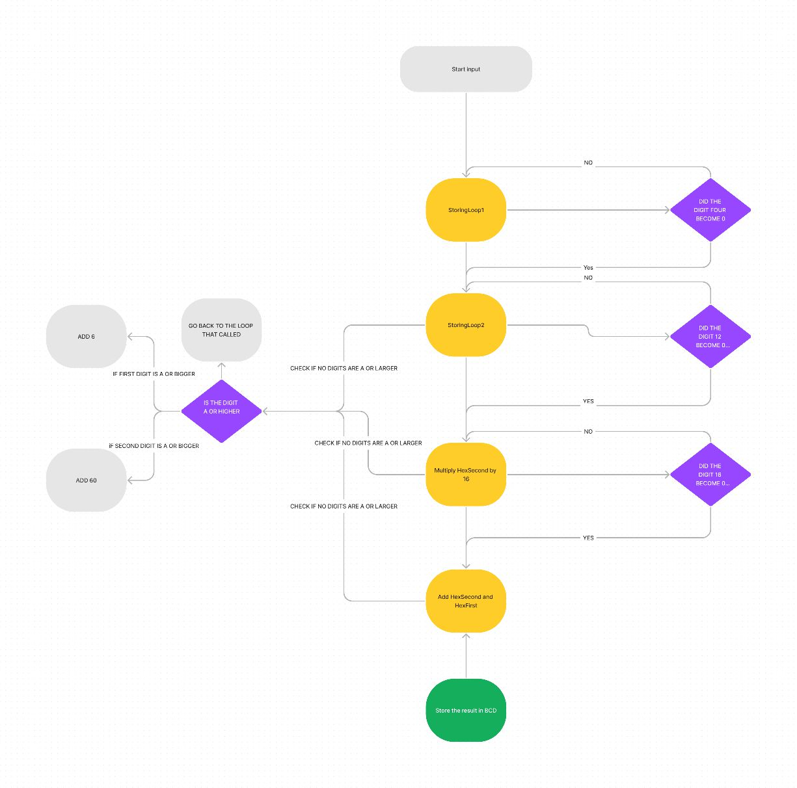
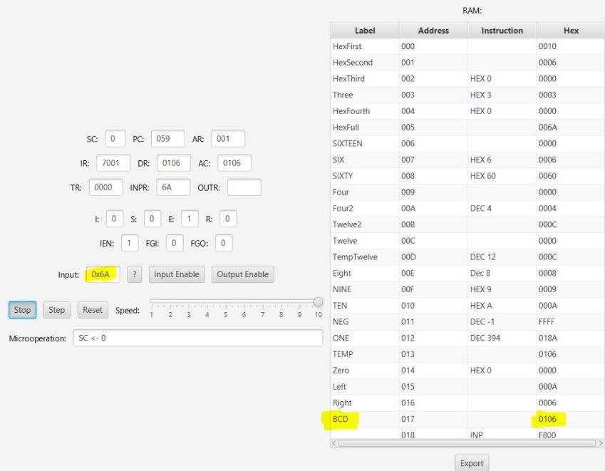

## Hexadecimal to Decimal to BCD Conversion (Project done during the second year of my bachelor's degree)

This code is based on an observation regarding the conversion of Hexadecimal to Decimal and then to Binary-Coded Decimal (BCD). The key observation is that the BCD representation of a Hexadecimal number is equivalent to its Decimal form. 

For example:
- The Hexadecimal number `(FF)16` is `(255)10` in Decimal, or `(11111111)2` in Binary.
- Converting this Binary number to BCD results in `(0010 0101 0101)2`.
- When this BCD number is converted back to Hexadecimal, we get `(255)16`.

### Flowchart

The flowchart below outlines the overall logic of the code implementation:

### I. Storing the Left and Right Digits Separately
- I separate the left and right digits of the Hexadecimal number by shifting either left or right and storing the results in `HexFirst` or `HexSecond` variables.

### II. Maintaining Decimal Representation
- I ensure that the digits remain in their Decimal representation. If a digit becomes `A` or larger, we convert it to its Decimal form by:
  - Adding `6` to the digit if it’s in the first position.
  - Adding `60` if it’s in the second position.

  **Examples:**
  - `0A + 6 = 10`
  - `A0 + 60 = 100`

### III. Multiplying the Second Digit by 16
- I multiply the digit in the second position by `16`. This is done by adding the digit to itself `16` times, ensuring that all numbers remain in their Decimal representation.

### IV. Adding the First Digit
- Finally, I add the first digit to the product of the second digit and `16`, yielding our desired result.

### Implementation Results

As can be seen in the code below, this implementation on the MANO simulator worked successfully. The execution time takes a little more than expected (~8 minutes), but it yields the desired results. Final code and different input images can be observed in the following pages.

